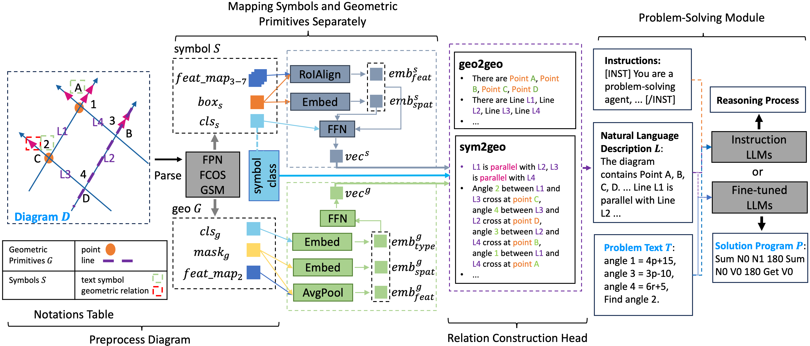

# Geometry-Diagram-Description (In Progress)

<!-- This repository is the official implementation of [My Paper Title](https://arxiv.org/abs/2030.12345).  -->
This repository is the official implementation of <<GOLD: Geometry Problem Solvers with Natural Language Description>>

<!-- >📋  Optional: include a graphic explaining your approach/main result, bibtex entry, link to demos, blog posts and tutorials -->


## Requirements

To install requirements:

```setup
pip install -r requirements.txt
```

>  - Python version should be greater than or equal to 3.7.
>  - All the hyper-parameters and configuration settings on in the `./prototype/config.yaml`.

## Prepare Dataset
Create `data` folder in the main directory, then please download datasets (PGDP5K, PGPS9K, UniGeo, Geometry3K) by yourself, and save them according to below instructions:
> - For PGDP5K dataset, please refer to author's [homepage](http://www.nlpr.ia.ac.cn/databases/CASIA-PGDP5K/index.html) to get access to the dataset, the unzipped directory is the same as the directory tree below.
> - For PGPS9K dataset, please refer to author's [homepage](http://www.nlpr.ia.ac.cn/databases/CASIA-PGPS9K/index.html) to get access to the dataset, the unzipped directory is the same as the directory tree below.
> - For UniGeo dataset, please download from the authors' [github](https://github.com/chen-judge/unigeo) directly. Notably, UniGeo dataset stores images and annotations into the binary files, please use our `./train_utils/convert_unigeo_to_desired_data.py` script to extract the images and annotations, which are better for intuitional understanding and compatible to our training process. The directory format should be consistent to the directory tree below.
> - For the Geometry3K dataset, there is no need to download due to PGPS9K dataset contains the original Geometry3K dataset.  

The final directory tree for the `data` folder should be like:
```
data
├─ PGDP5K
│    ├─ annotations
│    ├─ our_diagram_logic_forms_annot.json
│    ├─ test
│    ├─ train
│    └─ val
├─ PGPS9K_all
│    ├─ Diagram
│    ├─ Geometry3K
│    ├─ PGPS9K
│    └─ diagram_annotation.json
└─ UniGeo
       ├─ UniGeo_CAL_test.json
       ├─ UniGeo_CAL_train.json
       ├─ UniGeo_CAL_val.json
       ├─ UniGeo_PRV_test.json
       ├─ UniGeo_PRV_train.json
       ├─ UniGeo_PRV_val.json
       ├─ images_unigeo_cal
       ├─ images_unigeo_prv
       ├─ ori_data
       └─ unigeo_prv_images
```  
You can also download the zipped data from [here](https://drive.google.com/file/d/1Vu8SM7YSH9KOpmoKY6zUH6nFTVp_WlSx/view?usp=sharing), which maintains the same directory tree formats as above. In addition, it contains the natural language diagram descriptions for each data (in "xxx_parst_xxx.json"). Remember change the directory name to `data`.  

## Image Parser Module Training and Inference (for relation construction)

### Train Image Parser Module

To train the Image Parser Module, you need to change the arguments in `prototype/config.yaml`. These arguments and their values should be:  
```
main_args:
  is_train: True
  all_img_path: "data/PGPS5K/train"
  dataset_name: "PGDP5K"
  project_name: ${name your own project name, for WandB use}
  item_name: ${name your own item name, for WandB use}
  backbone_weights: "https://cloudstor.aarnet.edu.au/plus/s/xtixKaxLWmbcyf7/download#mobilenet_v2-ecbe2b5.pth"
  save_dir: "checkpoints"
  train_annot_path: "data/PGPS5K/annotations/train.json"
  eval_annot_path: "data/PGPS5K/annotations/val.json"
  test_annot_path: "data/PGPS5K/annotations/test.json"
  train_img_path: "data/PGPS5K/train"
  eval_img_path: "data/PGPS5K/val"
  test_img_path: "data/PGPS5K/test"
  aspect_ratio_group_factor: 3
  train_img_per_batch: 10
  test_img_per_batch: 10
  workers: 8
  dist_url: "env://"
  device: "cuda"
  wandb_key: null   # put your "wandb key" if enable wandb, otherwise put "null"
  epochs: 100
  warmpup: False
  only_train_rel: False
  only_parse: True
```  

Next run `prototype/start.sh`:  
```
# single gpu (A100(40G))
CUDA_VISIBLE_DEVICES=0 python main.py ${ARGS}

# two gpus on one node (A100(40G) * 2)
torchrun --nproc_per_node=2 main.py ${ARGS}
```  

### Inference and Relation Construction Module Training  
After the image parser is trained, we start to train the Relation Construction Module, please modify the arguments in `prototype/config.yaml`:  

> 1. Specify the load image parser weights in :  
```
main_args:
  resume: ${save_dir}
```  
> 2. Change the arguments to train the Relation Construction Module alone, or the Relation Construction Module with fine-tune the Image Parser Module. In our experimetn setup, we choose the latter to fine-tune the Image Parser Module while training the Relation Construction Module:  
```
# only train Relation Construction Module
main_args:
  only_train_rel: True
  only_parse: False

# train Relation Construction Module and fine-tune Image Parser Module
main_args:
  only_train_rel: False
  only_parse: False
```  
> 3. The Relation Construction Module is trained on PGPS9K dataset, so modify the data path:  
```
main_args:
  dataset_name: "pgps9k"
  train_annot_path: "data/PGPS9K_all/PGPS9K/train.json"
  eval_annot_path: "data/PGPS9K_all/PGPS9K/test.json"
  test_annot_path: "data/PGPS9K_all/PGPS9K/test.json"
  train_img_path: "data/PGPS9K_all/Diagram"
  eval_img_path: "data/PGPS9K_all/Diagram"
  test_img_path: "data/PGPS9K_all/Diagram"
```  
> 4.  Next run `prototype/start.sh`, the Relation Construction Module can be trained on only one A100 GPU(40G): 
```
CUDA_VISIBLE_DEVICES=0 python main.py ${ARGS}
```  

### Relation Construction Module Inference  
To provide natural language diagram descriptions data for training the Problem Solving Module, we need to use the trained Image Parser Module and Relation Construction Module to generate natural language diagram descriptions for the diagrams. Please follow the instructions below:  

> 1. Change to test mode:  
```
main_args:
  is_train: False
```  
> 2. Change the dataset name for the dataset you want to generate natural language diagram descriptions for:  
```
# example, choose "UniGeo" dataset.
main_args:
  dataset_name: "UniGeo"  # PGDP5K, UniGeo, pgps9k, geometry3k
```  
> 3. Change the path for the dataset:  
```
# Notably, we need to generate natural language diagram descriptions for train and test dataset for training Problem Solving Module.
main_args:
  test_annot_path: "data/UniGeo/UniGeo_CAL_train.json"
  test_img_path: "data/UniGeo/images_unigeo_cal"
```  
> 4. Next run `prototype/start.sh`: 
```
CUDA_VISIBLE_DEVICES=0 python main.py ${ARGS}
```  

### Download the trained Image Parser Module and Relation Construction Module:  
If you don't want to train modules from scratch, please download our public trained modules:  
- [Image Parser Module](https://drive.google.com/file/d/11WP8CN6z_ihziUkc4kCl0VDlgCvfVUEJ/view?usp=sharing).
- [Relation Construction Module](https://drive.google.com/file/d/1519vBOoLyYWk9xTxvreYXzjw3AvtFdpP/view?usp=sharing).  

## Problem Solving Module Training and Inference  

### Train
To train the Problem Solving Module, please follow the instructions below:  
> 1. Modify the path for dataset annotations and natural language diagram descriptions:  
```
# for PGPS9K datset
main_args:
    dataset_name: "pgps9k"  # PGDP5K, UniGeo, pgps9k, geometry3k
solution_generation_data_args:
  t5_train_annot_path: "data/PGPS9K_all/PGPS9K/train.json" 
  t5_eval_annot_path: "data/PGPS9K_all/PGPS9K/test.json" 
  t5_test_annot_path: "data/PGPS9K_all/PGPS9K/test.json"
  t5_train_parse_path: "data/PGPS9K_all/PGPS9K/PGPS9K_parse_train_pgps9k.json"
  t5_eval_parse_path: "data/PGPS9K_all/PGPS9K/PGPS9K_parse_test_pgps9k.json"
  t5_test_parse_path: "data/PGPS9K_all/PGPS9K/PGPS9K_parse_test_pgps9k.json"
  problem_form: "pgps9k" # calculation, proving, pgps9k, geometry3k
```  
> 2. Next run `prototype/start.sh`: 
```
# train program generator
# CUDA_VISIBLE_DEVICES=0 python main_gp.py ${ARGS}
```  

### Test  
To test the GOLD performances, please follow the instructions below: 
> 1. Change to test mode:  
```
main_args:
  is_train: False
```  
> 2. Specify the `gp_resume`:  
```
solution_generation_model_args:
  gp_resume: null
```  

If you want to use ground-truth diagram annotations, please modify:  
```
solution_generation_data_args:
  use_golden_diagram: True
  golden_diagram_path: "data/PGPS9K_all/golden_diagram_annotation_logic_form.json"
```
***You can use scripts in `./anno2clause/generate_logic_form.py` to convert the ground-truth clauses of PGPS9K dataset into natural language desriptions. The scripts is modified based on the tools provided by the author of PGPS9K.***  

### Use Llama2, CodeLlama as Problem-solving Module  

Please run script `eval_llms/sh_files/llama2_7b_jiaxin_sample_script/evaluate.sh`, you should modify `eval_config.yaml` in the same directory to specifiy the weights of the LLMs you save on the machine.


### Download the trained models:  
If you don't want to train module from scratch, please download our public trained modules:  
- [Best Problem Solving Module for UniGeo CAL](https://drive.google.com/file/d/1CLA9No0S4iG0IP64SPRra42NvT0Sa4tO/view?usp=sharing).
- [Best Problem Solving Module for UniGeo PRV](https://drive.google.com/file/d/1GyS8ZTPCG507gQJOsco5ywo7TUhJ7MiA/view?usp=sharing).
- [Best Problem Solving Module for PGPS9K](https://drive.google.com/file/d/1e-vryoKpJXpS29XGkRW7_OiywwvFGixl/view?usp=sharing).  
- [Best Problem Solving Module for Geometry3K](https://drive.google.com/file/d/1J3VDmXBJPxO_CoWNgtcW5GtQs00V28vV/view?usp=sharing).  

## Results

Our model achieves the following performance:

| Model and Datasets      | UniGeo CAL |  UniGeo Prv | PGPS9K Test | Geometry3K Test |
| ----------------------- |------------|------------| ------------|     ------------|
| BERT2Prog               |  54.7   |  48.0   |   n/a       | n/a |
| NGS                  |  56.9   |   53.2  |   34.1      | 35.3|
| Geoformer                |  62.5  |  56.4    |   35.6 |  36.8      |
| InterGPS                    |  56.8  |  47.2   |   38.3      | 44.6 |
| InterGPS (GT)  | n/a |  n/a   |   59.8       |  64.2 |
| PSPNET |  53.2  |  42.3   |   58.8      |  59.5 |
| PGPSNet (GT)    |  n/a  |  n/a   |   62.7       | 65.0 |
| GOLD   | **75.2** | **98.5** | **60.6**  | **62.7** |
| GOLD (GT)           |  n/a  |  n/a   |    65.8     | 69.1 |

>📋  All results are from our experiments, the work of Chen et al. and the work of Zhang, Yin, and Liu.


## Contributing

[](https://opensource.org/licenses/MIT)